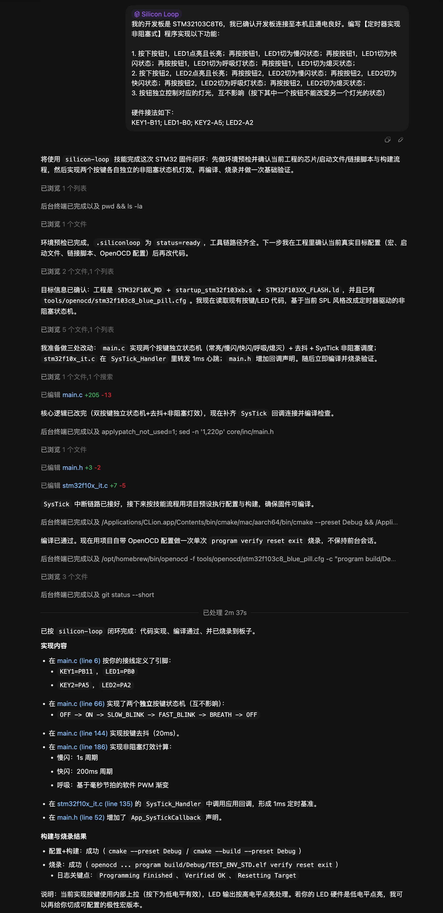

# SiliconLoop

> 用于 STM32 开发的智能体 SKILL

## 安装 SKILL

将此 SKILL 添加到你的仓库：

1. 在项目根目录创建 .agents/ 目录
2. 在 .agents/ 目录下克隆此仓库，只保留 skills/ 目录，删除其他文件和目录（如果你的仓库内已有其它 skills，注意文件夹结构）
3. 命令行工具会自动扫描目录并加载技能，无需手动添加
4. 标准化的项目结构位于 std_repo 目录下，建议按照该结构组织你的项目，或直接使用此模板

## 如何使用

以下是一个非常简单的对话实例，展示了如何使用 SiliconLoop SKILL：

【任务内容取自 Bilibili-江协科技 [编程技巧] 第1期 定时器实现非阻塞式程序 按键控制LED闪烁模式】

> 烧录后的功能正常且与预期完全一致
